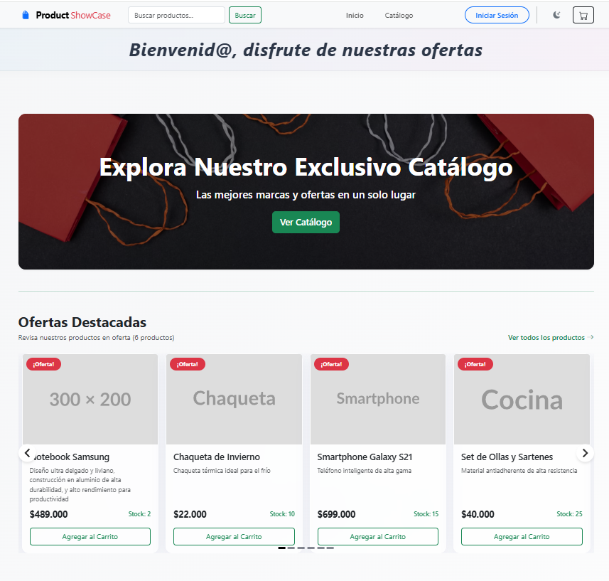
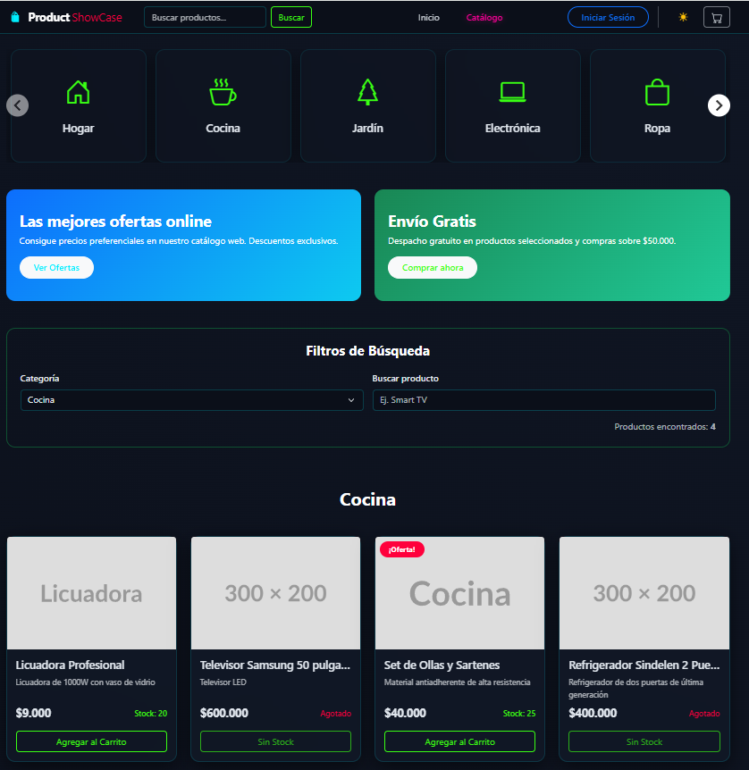
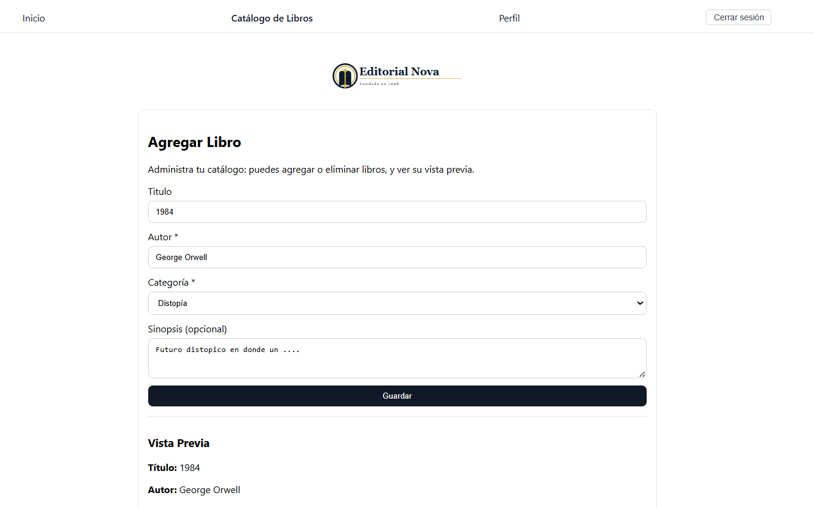
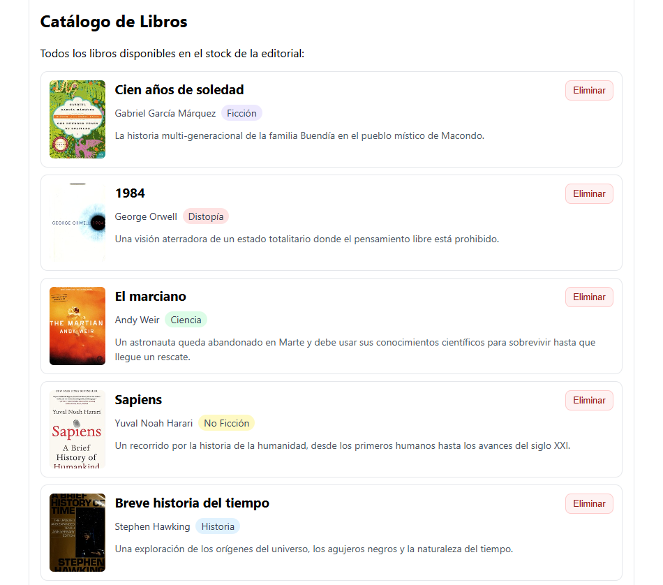
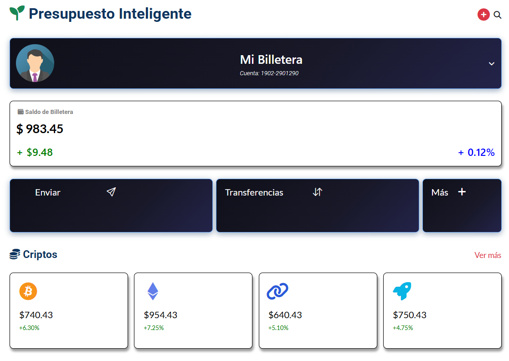
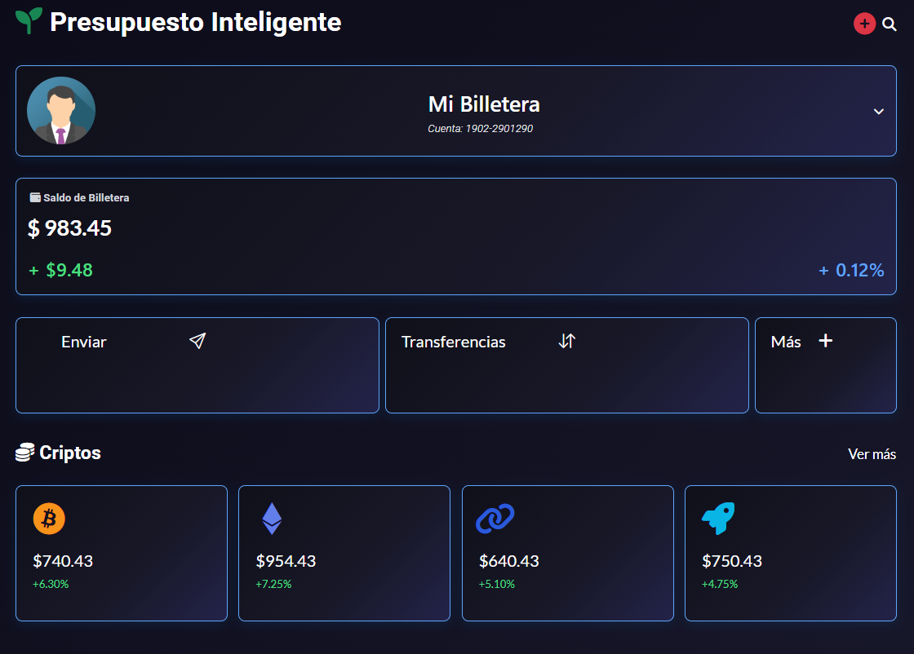

# ¡Hola! Soy Jorge Tamayo Cabello 👋

  

### Apasionado por la tecnología y desarrollador Front-End en constante evolución.

Me especializo en la creación de **Single Page Applications (SPAs)** escalables y eficientes utilizando el ecosistema de **Vue.js**. Mi enfoque se centra en la implementación de arquitecturas limpias, componentes altamente reutilizables y principios de sobriedad digital para garantizar una experiencia de usuario óptima.

Domino la metodología **BEM** y el preprocesamiento con **SASS** para un desarrollo de estilos profesional y mantenible. Actualmente, mi curiosidad me impulsa a explorar el potencial de la **IA integrada al desarrollo** y a expandir mi stack hacia el **Backend**.

Mi enfoque principal es transformar requerimientos complejos en interfaces intuitivas y eficientes.

---

## 📈 Mis Estadísticas de GitHub

  

---

## 🛠️ Mi Stack Técnico Principal

### 📱 Core Web

### 🏗️ Framework & Ecosistema

### 🎨 Estilos & UI

### 🛠️ Herramientas & Deployment

---

## 🚀 Qué estoy haciendo ahora

- 💻 Construyendo mi portafolio digital aplicando buenas prácticas de despliegue y performance.
- 🧠 Profundizando en Desarrollo con IA.
- 🤝 Buscando mi primera oportunidad laboral como Front-End Trainee/Junior.

---

## 🏆 Proyectos Destacados

<table border="0">
  <!-- Proyecto 1 -->
  <tr align="center">
    <td width="100%" valign="top">
      <h3>Proyecto 1: Product Showcase SPA</h3>
      

        
        
      

      
Single Page Application moderna diseñada como catálogo interactivo. Enfoque en performance y UX fluida.

      

        
        
      

      
🛠️ <b>Vue 3, Vite, Vue Router 4, Pinia, Bootstrap 5, Firebase, Vuetify, GitHub Pages, Netlify</b>

       
    </td>
  </tr>
  
  <!-- Proyecto 2 -->
  <tr align="center">
    <td width="100%" valign="top">
      <h3>Proyecto 2: Booklist SPA</h3>
      

        
        
      

      
Gestión de catálogos bibliográficos con filtrado dinámico y registro en tiempo real. Interfaz escalable.

      

        
        
      

      
🛠️ <b>Vue 3, Vite, Vue Router 4, Pinia, GitHub Pages, Vercel</b>

       
    </td>
  </tr>

  <!-- Proyecto 3 -->
  <tr align="center">
    <td width="100%" valign="top">
      <h3>Proyecto 3: SmartBudget</h3>
      

        
        
      

      
Visualizador de finanzas personales con arquitectura modular y diseño Mobile First.

      

        
        
      

      
🛠️ <b>BEM, SASS, Bootstrap 5, Flexbox, CSS Grid</b>

       
    </td>
  </tr>

  <!-- Próximamente -->
  <tr align="center">
    <td width="100%" valign="top">
      <h3>✨ Próximamente</h3>
      
Nuevos proyectos explorando el mundo del Backend y el desarrollo de aplicaciones con asistencia de la IA.

       
    </td>
  </tr>
</table>

---

## 📫 Conectemos

- **LinkedIn:** [https://www.linkedin.com/in/jorge-tamayo-14a9903b1/](https://www.linkedin.com/in/jorge-tamayo-14a9903b1/)
- **Portafolio Web:** [Enlace a tu portafolio]
- **Email:** jltamayocabello@gmail.com
